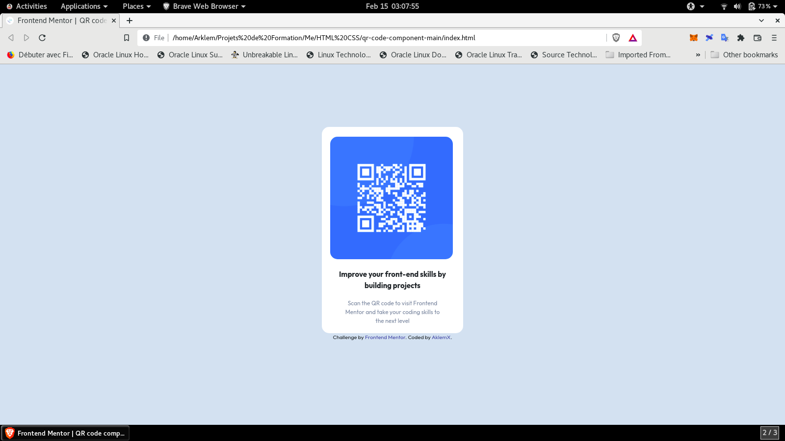

# Frontend Mentor - QR code component solution

This is a solution to the [QR code component challenge on Frontend Mentor](https://www.frontendmentor.io/challenges/qr-code-component-iux_sIO_H). Frontend Mentor challenges help you improve your coding skills by building realistic projects. 

## Table of contents

- [Overview](#overview)
  - [Screenshot](#screenshot)
  - [Links](#links)
- [My process](#my-process)
  - [Built with](#built-with)
  - [What I learned](#what-i-learned)
  - [Continued development](#continued-development)
- [Author](#author)

## Overview

### Screenshot

### Links

- Solution URL: [Qr-Component-Main Repository](https://github.com/ArklemX/qr-code-component-main)
- Live Site URL: [Qr-Component-Main Site URL](https://arklemx.github.io/qr-code-component-main/)

## My process

### Built with

- Semantic HTML5 markup
- CSS custom properties
- Flexbox

### What I learned

During this challenge, I was forced to look for ways to center the map. It needed to be in the middle of the page, so I opted for Flexbox.

To find my way around, I found a FlexBox cheatsheet: [Flex-CheatSheet](https://yoksel.github.io/flex-cheatsheet/)

### Continued development

Some concepts, for me, deserve to be deepened because I absolutely do not master them:
   - Flexbox
   - Grid

**Note: Delete this note and replace the list above with resources that helped you during the challenge. These could come in handy for anyone viewing your solution or for yourself when you look back on this project in the future.**

## Author

- Frontend Mentor - [@ArklemX](https://www.frontendmentor.io/profile/ArklemX)
